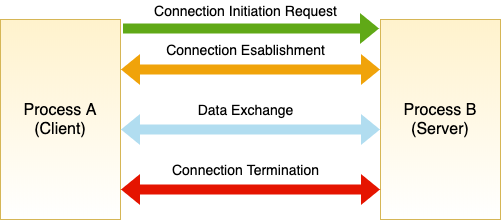

# TCP (Transmission Control Protocol)

TCP is a transport layer protocol designed for **Reliable Communication** between processes. The theoretical OSI model like below:

is the acronym of Open System Interconnection which is a **conceptual model** that **characterizes and standardizes** the communication functions of a telecommunication or computing system **without regards to its underlying inernal structure and technology**. So, what is TCP/IP stack? TCP/IP stack is the **Practical Implementation** of OSI model. What is actually implemented inside OS is something like this:

Researchers and implementors have decided to put presentation and session layer implementations partially into application layer and transport layer. So, according to TCP/IP protocol stack, each layer is responsible for:
* physical layer: Transmit data as electrical signal (electrical engineers' concern!)
* data link layer: responsible for transmission of data from a node to its adjacent node (node to node delivery).
* network layer: responsible for transmission of data from a source machine to destination machine (host to host delivery).
* transport layer: responsible for transmission of data from a process in a machine to another process which resides in another machine(process to process delivery).
* application layer: apps such as Ping(ICMP), whatsApp, etc...

In this tutorial, I am going to dive into **Transport Layer** in much more detail. The goals of Transport Layer which is called **Socket Layer** are:
* Facilitate communication (data exchange) between **applications** running on different machines deployed in the network.
* Transport Layer provides two world-wide standardized famous protocols to achieve its goal:
 * User Datagram Protocol (UDP)
 * Transmission Control Protocol (TCP)  
 * SCTP which is a hybrid of TCP and UDP
* TCP and UDP both have the same goal: Facilitate data exchange between processes, but they do in a different ways (Further, I'm gonna explain about the "different ways").

Before, I proceed further about TCP, I'm going to explain about UDP because it is fairly simple and straight forward.
### UDP
The essence of UDP is that it works on **Send and Forget** model. What does that mean?
UDP protocol does not maintain any state of the peer it is communicating with. So what is that mean also?

Suppose there is an application on Src, let's say application A. It wants to send a data to application B which is on Dst. How to determine the exact address of the process B? By two parameters:
* **Port number**: Each application which as an interaction with network, is identified with specific port number.
* **IP address**: Each machine on which the target process is running, is identified with IP address.

So, by having (DATA, PORT, IP), we can send data from Src to Dst using both TCP and UDP. But, UDP protocol does not remember who it was communicating with after sending data (**connection less**), and it also forgets that it has actually sent any data (**Stateless Protocol**). So, each request comes from application layer to UDP protocol, considered a fresh request. And also, UDP protocol sends data to the destination as soon as it gets data from application layer without bothering itself to say hello to the destination to see if it is alive or not, or there exists such process or not.

UDP protocol sends data in **chunks** or **discrite individual units** called **Datagram**. Also it is an unreliable protocol, which means it does not care that the packet has actually reached the destination or not. In addition, it does not guarantee **ordered delivery**, which means it does not care if datagrams are received out of order.

### TCP
TCP is way more complex compared to UDP. Here I'm diving into TCP features without having any further explanation:
* TCP is **Connection Oriented**: Before sending and receiving any data between Src and Dst over TCP, they must mutually agree and know each other first.
* TCP is **Stateful**: Both sender and receiver keep track of their connection and sent/received data.
* TCP is **byte Oriented**: It sends and receives data as continuous flow of bytes. It ensures that every byte of data is received successfully. So, TCP keeps track of data at byte level.
* TCP is also able to handle out of order delivery of packets at receiving end.
* **Reliable Delivery**: TCP ensures that all application data bytes are delivered to recipient, and none should be missed. TCP sender and receiver jointly implements Reliable Delivery procedures. Therefore, TCP implements **ARQ (Automatic Repeat Request**) for data recovery.

Suppose Src(left laptop) sends two packets 1 and 2. The receiver(left side laptop) only received 2nd packets. There should be a mechanism to make the Src understand that 1st packet is not delivered via Rst. Then the sender should Re-Transmit lost packet. The act of Re-transmission is called **ARQ**.

1) how receiver detects that packets are malformed? Checksum field.

2) How sender can determine whether the receiver has received the packet?

3) How long the sender should wait for ACK from the receiver?

4) What if ACK itself is lost?

5) How receiver will manage when it receives packets out of sequence?

6) What if receiver is slower than sender Or receiver receives duplicate copies of the packet?

7) What if network itself is slower or recover over a period of time?

8) With how much rate should the sender sends the packets to receiver?

**TCP ARQ** mechanism takes above stated points into consideration to implement its reliable data delivery functionality over lossy network.

Why TCP is called **Byte Oriented** protocol?

TCP keeps track of application data sent and received at **Byte Level**. TCP sender and receiver keeps track of how many bytes is sent and received by keeping explicit track of each byte of data separately. Each byte of data is tracked by a unique id called **sequence No.** at either ends. However, sending and receiving speed may not be the same in both machines. Therefore, TCP sender and receiver both need **Sending and Receiving buffers** implemented as **circular queues**. Remember, TCP is bi-directional.

Note that, data in sender buffer can be categorized into three parts: data which is sent to the receiver, data which is about to send to the receiver and data which has not yet come from sending process. TCP protocol in transport layer receives application data from application layer and glues **TCP header** to the application data, forms **TCP Segment**.

Note that, TCP is byte Oriented, while IP protocol is packet Oriented. Simply, IP datagram is called **packet**. In receiving side, the transport layer identifies which process the packet belongs to by specifying port number in TCP header. Size of segments is determined dynamically and keeps on changing depending on network or recipient state. Also, TCP chooses segment size to avoid unnecessary fragmentation of IP layer. Segments contain "N" bytes of data, where N is segment size. For example if a segment size is 512bytes, it means there are 512 bytes of application data is in the segment. TCP stamps every byte it is sending in segments with a unique number called **sequence number**. The SEQ No of first byte is also treated a **Segment number**.

Following Segment number, there is **Acknowledgment Number** which is a sequence number of a segment which TCP receiver expects from the sender to send in the next segment. ACK NO. 2000 means "Hey! I have successfully received 1999 bytes you sent, Now I'm waiting for 2000 bytes and more"

**TCP Piggyback**: In the same segment, TCP sender can ship next payload bytes, specifying new sequence number and at the same time ACKnowledge the previous TCP data it has received from peer using ACK NO and ACK bit. To understand more, there are three types of segments: Data Segment, Pure Ack Segment, Data + Ack Segment.

Each time a sender sends a message, it starts a timer. Receiver sends an acknowledgment back to the sender when it receives a message, so that, sender knows that it successfully transmitted the message. If a message is lost, the timer goes off, and sender retransmits the data.

The concept of connection oriented is illustrated in below picture:

Each stage is executed one after another. For connection less programs, phase 1,2 and 4 are not present.
TCP connection is uniquely defined by 4 tuples:

[TCP client IP address, TCP client Port Address, TCP server IP address, TCP Server Port address]

Above tuple is a unique identity of TCP connection.

### Three way handshake

In three way handshake stage, client which is Active Opener, sends **TCP SYN** packet with a sequence number. Note that, TCP SYN packet is a packet which the SYN flag is set. (ISN is abbreviated of Initial sequence Number).

1) SYN = want to initiate TCP connection. All my future segments have seq no 100+. The packet does not contain any application data, consume 1 sequence number.

2) ACK- client's request for connection initiation specified in segment with seq no 101. All future segments from the sever will have seq no 1000+.

3) ACK- request specified in server's segment with sequence no 1000 -1 is accepted.

In the 1st and 2nd, each party is telling the other party the ISN it wishes to use. So, steps 1 and 2 combined is called sequence number synchronization. At the end of stage 2, client can send TCP data segments to the server. TCP server can only ACK the TCP data from client. TCP server cannot send its own TCP data segments to the client. So, this situation is called **uni-direction (Half Open) communication**. At the end of stage 3, the server has got the permission from the client, and now TCP server can also send data to the TCP client.(**bi-directional communication**)

In closing the connection, the approach is quite similar with that of establishing the connection. The client is active closer and the server is passive closer. For finishing the connection, first the client sends a **FIN** message. The client wishes to terminate the connection using close(). Server receives the connection termination request, and acknowledges the request by sending ACK. When the client receives the Ack from the server, it closes the connection. So, after the second stage, the client has closed the connection successfully. After this point, the client cannot send segments with progressive seq# anymore. However, it can only ACKnowledge the segments coming from the server(Half close). Since the server knows that the client is looking to terminate the connection, it will also initiate connection termination by sending FIN segment to the client. At the 4th stage, the client sends ACK confirming that 1600th segments has been received and approves the connection termination request by sending (ACK 1601). Note that, the sequence no in state 2 and 3 is the same.

some useful notes:
* SYN segments do not contain any application data, yet they consume 1 sequence number because they need to be acknowledged.
* FIN segments **MAY** not contain any application data, yet they consume at least 1 sequence number because they need to be acknowledged.
* Pure ACKs do not contain any application data, they do not consume any sequence number either because ACKs are not acknowledged.
* Data segments consume as many sequence numbers as the number of application bytes they are carrying as payload.

Rule: **Any segments that needs an acknowledgment consumes a sequence number**.

Now, suppose there is a dead server and the client wants to reach it out. The client sends SYN message but it does not receive any SYN/ACK message from the server. The client waits for some times and resend SYN again, and there is no answer still. For how long the client tends to send the server its SYN message?
Answer: By default, number of maximum retries is **5**. But, there is another concept called **Exponential Back-off**. Each time the client does not receive any response from the server **for a specific time**, it re-sends it. The specific time starts from one and grows exponentially with the power of 2.

### TCP timeout and Retransmission

TCP protocol provides a reliable data delivery service between two applications using underlying network layer (IP) that may lose, duplicate, or reorder packets. In order to provide reliable delivery, TCP resends data it believes has been lost. BUT how TCP sender would know the data segments it had sent has been lost? Simple! TCP sender sets a timer when it sends data segments and expects an ACK from the receiver for this data segment before the timer expires. If ACK arrives before timers goes off, TCP believes the segment has been successfully delivered. If timer goes off and ACK has not yet arrived, TCP assumes segment has been lost and it retransmits the segment again. The time interval of the timer is called **Retransmission Timeout (RTO)**. What should be the appropriate value of RTO? Due to stochastic behavior of the network, the value of RTO needs to be calculated dynamically by TCP sender during the course of operation. According to below picture, the bigger or smaller the amount of RTO have some problems:

long RTO: causes network under utilization.

small RTO: causes unnecessary retransmission and network congestion.

Also, there is another problem which is called **Retransmission Ambiguity problem**, that is, in false retransmission, the sender cannot precisely calculate the amount of RTT. TCP is unable to distinguish two separate acknowledgements for the same sequence number. A timeout occurs before an ACK is received, and packet is retransmitted. The ACK for packet arrives a bit later and the source measures a wrong value for the RTT.

The solution to this problem is **Karns algorithm**. Karns algorithm has two phases:
* Ignore measured RTT for retransmitted segments for RTO evaluation, Because measured RTT for retransmitted segments would **skew** the RTO incorrectly, throw away the unreliable data. In other word, using the original transmission for RTT measurement, causes Over-Estimation, whereas using  the most recent retransmission for RTT measurement causes Under-Estimation and thus gives very negative effect.
* Use Back-off RTO for retransmitted segments and **do not consider their measured RTT for RTO evaluation**. Subsequent retransmission timers are double the previous. The back-off factor is not reset until there is a successful data transmit that does not require a retransmission.

All BS aside, simply the algorithm says that there is a base amount of RTO(Let's say 2sec). Whenever the sender sends a segment and receives its corresponding ACK within the 2 secs, it's OK. If for any reason, the ACK is not received within RTO, then the sender retransmits the segment again and RTO is doubled of the previous. Finally, if the ACK is received successfully, the sender resets the amount of RTO to the base and goes on transmitting normally.

This exponentially slows down TCP from further congesting the already congested networks. Note that, RTT measurement of transmitted segments is not used for RTO evaluation. When TCP sender is able to send TCP segments without having to retransmit it, inflated RTO value is restored to the original. RTT of this segment is  considered for RTO evaluation.

As we see, timer based retransmission often leads to under-utilization of network capacity. Therefore, there is another technique for handling segment loss detection and retransmission called **Fast Retransmit**. It is called Fast Retransmit because TCP sender immediately detects the segment loss and retransmit it instantly. In Fast Retransmission, TCP sender triggers segment retransmission based on feedback from receiver rather than relying on retransmission timer expiry, hence segment loss repair is even quicker. A typical TCP implementation implements both Fast Retransmission and timer based retransmission strategy, so don't think one of them is substitute for other one.

Suppose, client sends 4 segments simultaneously, and the segment with seq no 200 is lost, just like below diagram:

The server then sends ACK with seq no 201, meaning that segment 200 has not yet arrived. At this time, what will the client send? just segment 200 or something else? Here is the complicated part! There is a timer as well! We should take it into account. So to start the story again with the presence of the timer, it is like this:
When the client sends a chunk of segments with corresponding seq nos, the server receives them in a array like buffer. When let's say segment 200 is lost, the position of corresponding segment will be empty. So, the server realizes that the segment 200 is not yet arrived. Therefore, it sends ACK with No 201 meaning that the segment 200 has not yet arrived. So, when the ACK is received by the client, it is the first ACK corresponding to the segment with seq no 200. But since TCP client has sent segment 200 **and** retransmission timer corresponding to the segment 200 has not yet expired, the TCP sender do not take any action as of now. So, if the client has some segment to send, it will send (segments 500, 600 and 700).

The server receives three new incoming segments and still the place of segment 200 is empty, therefore, it resends the ACK 201 again for the response of segment 500. similarly, the server again responses the client the ACK 201 for reception of segment 600, and again for reception of segment 700.

So, at this time, if the TCP client receives 3 consecutive ACKs for specific seq no, it will retransmit the segment with that seq number to fill the place of that segment in the server. This situation is called **Triple duplicated ACK**.

|**Timer Based Retransmission**| **Fast Retransmission**|
|:-------------------:|:------------------:|
|Segments are retransmitted when Retransmission timer expires| Segments are retransmitted instantly when sender receives 3 duplicated ACK |
|Result in sender to sit idle for some time | Instant retransmission of lost or out of order segments |
| Network under utilization | Network optimal utilization |
| no redundant retransmission of segments | dup ACKs lead to redundant retransmission of segments, network BW wastage, contribution to congestion, etc. |

Similarly, this approach can be implemented when loosing multiple segments and having multiple empty place in receiver side. In this situation, the receiver sends ACK corresponding to the first lost segment. The question is how to improve such mechanism of sending multiple ACKs to make the sender re-sends lost segments? By using **SACK**.

One of the 3-duplicated ACK disadvantages is redundant retransmission.

### Selective Acknowledgments (SACKs)
The goal of SACK is to fill the buffer of the recipient empty holes in one shot (1 RTT). Selective ACKs are ACKs with additional capability that such ACKs can carry range of integers along with them. TCP header formant allows ACKs to carry set of pair of integers which represents holes in TCP recipient buffer.

SACK blocks are pair of 32 bit integers representing the holes. These are specified in **options** part of TCP header. A SACK can contain 3 or 4 SACK blocks. SACK enabled receiver can repair its 3 or 4 holes **per RTT** as compared to non-SACK enabled receiver which can repair only one hole per RTT.

TCP Acknowledgment number is the mechanism which TCP receiver uses to tell the TCP sender how many bytes it has received, and what it expects next. TCP receiver **DO NOT** send ACK for every segment or byte of data it receives. Acknowledging every byte by receiver will trigger too many ACK segments, if this happens, then TCP header overhead consumes more network bandwidth and resources than TCP payload. When TCP receiver receives too many segments in a quick succession. it acknowledges all of them by single ACK. Of course TCP cannot delay the cumulative ACK segments indefinitely, otherwise it will trigger unnecessary retransmission. Cumulative ACKs which are also called Delayed-ACK causes less traffic.

As soon as the receiver sends SACK, it start Delayed ACK timer. As long as this timer is running, TCP does not send any fresh ACK. After running out of the Delayed ACK timer, the receiver sends cumulative ACK to the sender, and starts the timer again. If the receiver has some data to send, it will send the data thereby acknowledging the pending segments, and it will cancel the Delayed timer and reset it.
