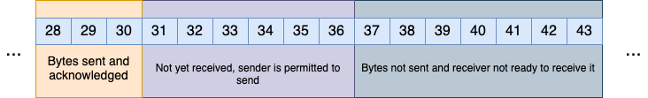
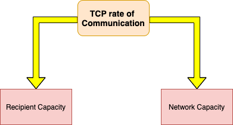

# TCP (Transmission Control Protocol)

TCP is a transport layer protocol designed for **Reliable Communication** between processes. The theoretical OSI model like below:


is the acronym of Open System Interconnection which is a **conceptual model** that **characterizes and standardizes** the communication functions of a telecommunication or computing system **without regards to its underlying inernal structure and technology**. So, what is TCP/IP stack? TCP/IP stack is the **Practical Implementation** of OSI model. What is actually implemented inside OS is something like this:


Researchers and implementors have decided to put presentation and session layer implementations partially into application layer and transport layer. So, according to TCP/IP protocol stack, each layer is responsible for:
* physical layer: Transmit data as electrical signal (electrical engineers' concern!)
* data link layer: responsible for transmission of data from a node to its adjacent node (node to node delivery).
* network layer: responsible for transmission of data from a source machine to destination machine (host to host delivery).
* transport layer: responsible for transmission of data from a process in a machine to another process which resides in another machine(process to process delivery).
* application layer: apps such as Ping(ICMP), whatsApp, etc...


In this tutorial, I am going to dive into **Transport Layer** in much more detail. The goals of Transport Layer which is called **Socket Layer** are:
* Facilitate communication (data exchange) between **applications** running on different machines deployed in the network.
* Transport Layer provides two world-wide standardized famous protocols to achieve its goal:
 * User Datagram Protocol (UDP)
 * Transmission Control Protocol (TCP)  
 * SCTP which is a hybrid of TCP and UDP
* TCP and UDP both have the same goal: Facilitate data exchange between processes, but they do in a different ways (Further, I'm gonna explain about the "different ways").

Before, I proceed further about TCP, I'm going to explain about UDP because it is fairly simple and straight forward.
### UDP
The essence of UDP is that it works on **Send and Forget** model. What does that mean?
UDP protocol does not maintain any state of the peer it is communicating with. So what is that mean also?

Suppose there is an application on Src, let's say application A. It wants to send a data to application B which is on Dst. How to determine the exact address of the process B? By two parameters:
* **Port number**: Each application which as an interaction with network, is identified with specific port number.
* **IP address**: Each machine on which the target process is running, is identified with IP address.

So, by having (DATA, PORT, IP), we can send data from Src to Dst using both TCP and UDP. But, UDP protocol does not remember who it was communicating with after sending data (**connection less**), and it also forgets that it has actually sent any data (**Stateless Protocol**). So, each request comes from application layer to UDP protocol, considered a fresh request. And also, UDP protocol sends data to the destination as soon as it gets data from application layer without bothering itself to say hello to the destination to see if it is alive or not, or there exists such process or not.

UDP protocol sends data in **chunks** or **discrite individual units** called **Datagram**. Also it is an unreliable protocol, which means it does not care that the packet has actually reached the destination or not. In addition, it does not guarantee **ordered delivery**, which means it does not care if datagrams are received out of order.

### TCP
TCP is way more complex compared to UDP. Here I'm diving into TCP features without having any further explanation:
* TCP is **Connection Oriented**: Before sending and receiving any data between Src and Dst over TCP, they must mutually agree and know each other first.
* TCP is **Stateful**: Both sender and receiver keep track of their connection and sent/received data.
* TCP is **byte Oriented**: It sends and receives data as continuous flow of bytes. It ensures that every byte of data is received successfully. So, TCP keeps track of data at byte level.
* TCP is also able to handle out of order delivery of packets at receiving end.
* **Reliable Delivery**: TCP ensures that all application data bytes are delivered to recipient, and none should be missed. TCP sender and receiver jointly implements Reliable Delivery procedures. Therefore, TCP implements **ARQ (Automatic Repeat Request**) for data recovery.

Suppose Src(left laptop) sends two packets 1 and 2. The receiver(left side laptop) only received 2nd packets. There should be a mechanism to make the Src understand that 1st packet is not delivered via Rst. Then the sender should Re-Transmit lost packet. The act of Re-transmission is called **ARQ**.

1) how receiver detects that packets are malformed? Checksum field.

2) How sender can determine whether the receiver has received the packet?

3) How long the sender should wait for ACK from the receiver?

4) What if ACK itself is lost?

5) How receiver will manage when it receives packets out of sequence?

6) What if receiver is slower than sender Or receiver receives duplicate copies of the packet?

7) What if network itself is slower or recover over a period of time?

8) With how much rate should the sender sends the packets to receiver?

**TCP ARQ** mechanism takes above stated points into consideration to implement its reliable data delivery functionality over lossy network.

Why TCP is called **Byte Oriented** protocol?

TCP keeps track of application data sent and received at **Byte Level**. TCP sender and receiver keeps track of how many bytes is sent and received by keeping explicit track of each byte of data separately. Each byte of data is tracked by a unique id called **sequence No.** at either ends. However, sending and receiving speed may not be the same in both machines. Therefore, TCP sender and receiver both need **Sending and Receiving buffers** implemented as **circular queues**. Remember, TCP is bi-directional.

Note that, data in sender buffer can be categorized into three parts: data which is sent to the receiver, data which is about to send to the receiver and data which has not yet come from sending process. TCP protocol in transport layer receives application data from application layer and glues **TCP header** to the application data, forms **TCP Segment**.

Note that, TCP is byte Oriented, while IP protocol is packet Oriented. Simply, IP datagram is called **packet**. In receiving side, the transport layer identifies which process the packet belongs to by specifying port number in TCP header. Size of segments is determined dynamically and keeps on changing depending on network or recipient state. Also, TCP chooses segment size to avoid unnecessary fragmentation of IP layer. Segments contain "N" bytes of data, where N is segment size. For example if a segment size is 512bytes, it means there are 512 bytes of application data is in the segment. TCP stamps every byte it is sending in segments with a unique number called **sequence number**. The SEQ No of first byte is also treated a **Segment number**.

Following Segment number, there is **Acknowledgment Number** which is a sequence number of a segment which TCP receiver expects from the sender to send in the next segment. ACK NO. 2000 means "Hey! I have successfully received 1999 bytes you sent, Now I'm waiting for 2000 bytes and more"

**TCP Piggyback**: In the same segment, TCP sender can ship next payload bytes, specifying new sequence number and at the same time ACKnowledge the previous TCP data it has received from peer using ACK NO and ACK bit. To understand more, there are three types of segments: Data Segment, Pure Ack Segment, Data + Ack Segment.

Each time a sender sends a message, it starts a timer. Receiver sends an acknowledgment back to the sender when it receives a message, so that, sender knows that it successfully transmitted the message. If a message is lost, the timer goes off, and sender retransmits the data.

The concept of connection oriented is illustrated in below picture:


Each stage is executed one after another. For connection less programs, phase 1,2 and 4 are not present.
TCP connection is uniquely defined by 4 tuples:

[TCP client IP address, TCP client Port Address, TCP server IP address, TCP Server Port address]

Above tuple is a unique identity of TCP connection.

### Three way handshake

In three way handshake stage, client which is Active Opener, sends **TCP SYN** packet with a sequence number. Note that, TCP SYN packet is a packet which the SYN flag is set. (ISN is abbreviated of Initial sequence Number).

1) SYN = want to initiate TCP connection. All my future segments have seq no 100+. The packet does not contain any application data, consume 1 sequence number.

2) ACK- client's request for connection initiation specified in segment with seq no 101. All future segments from the sever will have seq no 1000+.

3) ACK- request specified in server's segment with sequence no 1000 -1 is accepted.

In the 1st and 2nd, each party is telling the other party the ISN it wishes to use. So, steps 1 and 2 combined is called sequence number synchronization. At the end of stage 2, client can send TCP data segments to the server. TCP server can only ACK the TCP data from client. TCP server cannot send its own TCP data segments to the client. So, this situation is called **uni-direction (Half Open) communication**. At the end of stage 3, the server has got the permission from the client, and now TCP server can also send data to the TCP client.(**bi-directional communication**)

In closing the connection, the approach is quite similar with that of establishing the connection. The client is active closer and the server is passive closer. For finishing the connection, first the client sends a **FIN** message. The client wishes to terminate the connection using close(). Server receives the connection termination request, and acknowledges the request by sending ACK. When the client receives the Ack from the server, it closes the connection. So, after the second stage, the client has closed the connection successfully. After this point, the client cannot send segments with progressive seq# anymore. However, it can only ACKnowledge the segments coming from the server(Half close). Since the server knows that the client is looking to terminate the connection, it will also initiate connection termination by sending FIN segment to the client. At the 4th stage, the client sends ACK confirming that 1600th segments has been received and approves the connection termination request by sending (ACK 1601). Note that, the sequence no in state 2 and 3 is the same.


some useful notes:
* SYN segments do not contain any application data, yet they consume 1 sequence number because they need to be acknowledged.
* FIN segments **MAY** not contain any application data, yet they consume at least 1 sequence number because they need to be acknowledged.
* Pure ACKs do not contain any application data, they do not consume any sequence number either because ACKs are not acknowledged.
* Data segments consume as many sequence numbers as the number of application bytes they are carrying as payload.

Rule: **Any segments that needs an acknowledgment consumes a sequence number**.

Now, suppose there is a dead server and the client wants to reach it out. The client sends SYN message but it does not receive any SYN/ACK message from the server. The client waits for some times and resend SYN again, and there is no answer still. For how long the client tends to send the server its SYN message?
Answer: By default, number of maximum retries is **5**. But, there is another concept called **Exponential Back-off**. Each time the client does not receive any response from the server **for a specific time**, it re-sends it. The specific time starts from one and grows exponentially with the power of 2.


### TCP timeout and Retransmission

TCP protocol provides a reliable data delivery service between two applications using underlying network layer (IP) that may lose, duplicate, or reorder packets. In order to provide reliable delivery, TCP resends data it believes has been lost. BUT how TCP sender would know the data segments it had sent has been lost? Simple! TCP sender sets a timer when it sends data segments and expects an ACK from the receiver for this data segment before the timer expires. If ACK arrives before timers goes off, TCP believes the segment has been successfully delivered. If timer goes off and ACK has not yet arrived, TCP assumes segment has been lost and it retransmits the segment again. The time interval of the timer is called **Retransmission Timeout (RTO)**. What should be the appropriate value of RTO? Due to stochastic behavior of the network, the value of RTO needs to be calculated dynamically by TCP sender during the course of operation. According to below picture, the bigger or smaller the amount of RTO have some problems:

long RTO: causes network under utilization.


small RTO: causes unnecessary retransmission and network congestion.


Also, there is another problem which is called **Retransmission Ambiguity problem**, that is, in false retransmission, the sender cannot precisely calculate the amount of RTT. TCP is unable to distinguish two separate acknowledgements for the same sequence number. A timeout occurs before an ACK is received, and packet is retransmitted. The ACK for packet arrives a bit later and the source measures a wrong value for the RTT.


The solution to this problem is **Karns algorithm**. Karns algorithm has two phases:
* Ignore measured RTT for retransmitted segments for RTO evaluation, Because measured RTT for retransmitted segments would **skew** the RTO incorrectly, throw away the unreliable data. In other word, using the original transmission for RTT measurement, causes Over-Estimation, whereas using  the most recent retransmission for RTT measurement causes Under-Estimation and thus gives very negative effect.
* Use Back-off RTO for retransmitted segments and **do not consider their measured RTT for RTO evaluation**. Subsequent retransmission timers are double the previous. The back-off factor is not reset until there is a successful data transmit that does not require a retransmission.

All BS aside, simply the algorithm says that there is a base amount of RTO(Let's say 2sec). Whenever the sender sends a segment and receives its corresponding ACK within the 2 secs, it's OK. If for any reason, the ACK is not received within RTO, then the sender retransmits the segment again and RTO is doubled of the previous. Finally, if the ACK is received successfully, the sender resets the amount of RTO to the base and goes on transmitting normally.

This exponentially slows down TCP from further congesting the already congested networks. Note that, RTT measurement of transmitted segments is not used for RTO evaluation. When TCP sender is able to send TCP segments without having to retransmit it, inflated RTO value is restored to the original. RTT of this segment is  considered for RTO evaluation.

As we see, timer based retransmission often leads to under-utilization of network capacity. Therefore, there is another technique for handling segment loss detection and retransmission called **Fast Retransmit**. It is called Fast Retransmit because TCP sender immediately detects the segment loss and retransmit it instantly. In Fast Retransmission, TCP sender triggers segment retransmission based on feedback from receiver rather than relying on retransmission timer expiry, hence segment loss repair is even quicker. A typical TCP implementation implements both Fast Retransmission and timer based retransmission strategy, so don't think one of them is substitute for other one.

Suppose, client sends 4 segments simultaneously, and the segment with seq no 200 is lost, just like below diagram:


The server then sends ACK with seq no 201, meaning that segment 200 has not yet arrived. At this time, what will the client send? just segment 200 or something else? Here is the complicated part! There is a timer as well! We should take it into account. So to start the story again with the presence of the timer, it is like this:
When the client sends a chunk of segments with corresponding seq nos, the server receives them in a array like buffer. When let's say segment 200 is lost, the position of corresponding segment will be empty. So, the server realizes that the segment 200 is not yet arrived. Therefore, it sends ACK with No 201 meaning that the segment 200 has not yet arrived. So, when the ACK is received by the client, it is the first ACK corresponding to the segment with seq no 200. But since TCP client has sent segment 200 **and** retransmission timer corresponding to the segment 200 has not yet expired, the TCP sender do not take any action as of now. So, if the client has some segment to send, it will send (segments 500, 600 and 700).


The server receives three new incoming segments and still the place of segment 200 is empty, therefore, it resends the ACK 201 again for the response of segment 500. similarly, the server again responses the client the ACK 201 for reception of segment 600, and again for reception of segment 700.


So, at this time, if the TCP client receives 3 consecutive ACKs for specific seq no, it will retransmit the segment with that seq number to fill the place of that segment in the server. This situation is called **Triple duplicated ACK**.

|**Timer Based Retransmission**| **Fast Retransmission**|
|:-------------------:|:------------------:|
|Segments are retransmitted when Retransmission timer expires| Segments are retransmitted instantly when sender receives 3 duplicated ACK |
|Result in sender to sit idle for some time | Instant retransmission of lost or out of order segments |
| Network under utilization | Network optimal utilization |
| no redundant retransmission of segments | dup ACKs lead to redundant retransmission of segments, network BW wastage, contribution to congestion, etc. |

Similarly, this approach can be implemented when loosing multiple segments and having multiple empty place in receiver side. In this situation, the receiver sends ACK corresponding to the first lost segment. The question is how to improve such mechanism of sending multiple ACKs to make the sender re-sends lost segments? By using **SACK**.

One of the 3-duplicated ACK disadvantages is redundant retransmission.


### Selective Acknowledgments (SACKs)
The goal of SACK is to fill the buffer of the recipient empty holes in one shot (1 RTT). Selective ACKs are ACKs with additional capability that such ACKs can carry range of integers along with them. TCP header formant allows ACKs to carry set of pair of integers which represents holes in TCP recipient buffer.


SACK blocks are pair of 32 bit integers representing the holes. These are specified in **options** part of TCP header. A SACK can contain 3 or 4 SACK blocks. SACK enabled receiver can repair its 3 or 4 holes **per RTT** as compared to non-SACK enabled receiver which can repair only one hole per RTT.

TCP Acknowledgment number is the mechanism which TCP receiver uses to tell the TCP sender how many bytes it has received, and what it expects next. TCP receiver **DO NOT** send ACK for every segment or byte of data it receives. Acknowledging every byte by receiver will trigger too many ACK segments, if this happens, then TCP header overhead consumes more network bandwidth and resources than TCP payload. When TCP receiver receives too many segments in a quick succession. it acknowledges all of them by single ACK. Of course TCP cannot delay the cumulative ACK segments indefinitely, otherwise it will trigger unnecessary retransmission. Cumulative ACKs which are also called Delayed-ACK causes less traffic.

As soon as the receiver sends SACK, it start Delayed ACK timer. As long as this timer is running, TCP does not send any fresh ACK. After running out of the Delayed ACK timer, the receiver sends cumulative ACK to the sender, and starts the timer again. If the receiver has some data to send, it will send the data thereby acknowledging the pending segments, and it will cancel the Delayed timer and reset it.

### Sliding Window
The goal of having sliding window is to prevent overwhelming the receiver's buffer and also make sure the network resources are not under utilized. So each party has a ring buffer which denotes the window. As TCP is duplex connection, each sender and receiver has send and receive window. So, as a result, the send window of one device is the receive window of other device and vice versa.

TCP is a sliding window protocol, meaning it manages its flow control, congestion control, reliable data delivery by managing its send/receive windows. TCP send window can be classified in 4 categories.(Remember, TCP is byte oriented protocol, it keeps track of data flow at byte level and not segment level).

At any given point of time, we can classify the bytes of data in send window of TCP sender into four categories.

***First category***) bytes 28 to 30 which are sent by the sender and get acknowledged by receiver (sender received the ACKs successfully).

***Second category***) bytes 31 to 33 which are injected to the network via sender but not yet acknowledged by the receiver. it means that the sender has not yet received any ACK for bytes 31, 32 and 33.

***Third category***) bytes 34 to 36 which the sender has not yet injected to the network. But TCP sender is allowed to push these bytes into the network, because TCP receiver is ready to accept data.

***Forth category***) bytes 37 to 43 which TCP sender has received them from application process but it is not allowed to inject them to the network, because TCP receiver is not in the state of receiving new data. One reason probably is that the receiving window size in receiver side is not large enough to accommodate those amounts of bytes.

TCP receiver window on the other hand, has 3 categories like below:

***First category***) bytes which are received successfully and their corresponding ACKs are already sent.

***Second category***)Those amounts of bytes which the receiver is waiting for the sender to send them. As soon as the receiver receives bytes 31 to 36, it immediately stores them to its receiving buffer.

***Third category***)Those bytes which the receiver is not in a situation to receive them.

As a general rule, the size of send window in sending machine is:
```
Total Number of Bytes Which Sender Can Send + Not Send but Ready to Send
```

Similarly, the size of usable window size is defined as below:
```
Total Number of Bytes which Sender has not sent but ready to send and can send at any timer
```


If the receiver ever happens to receive bytes which falls outside the receive window, receiver will silently discard them. So, TCP receiver advertise the size of its receive window in every ACK that it sends to the TCP sender. So, the TCP sender having received this advertisement sets the size of its send window to the value advertised by receiver. By definition, send window determines the number of bytes the TCP sender can send in one go. Thus, TCP receiver controls the size of TCP sender's send window, this controls the rate at which the TCP sender can send the data to receiver. This is called **Window Based Flow Control**. overwhelming or congested TCP receiver tends to reduce its receive window size and advertise reduced size of its receive window in ACK to TCP sender, this, mitigating the congestion. So, in TCP connection, both peers advertise the size of their respective TCP receive window to other during TCP connection establishment phase (Three way handshake). it is worth seeing the TCP header once more:

The field Window with 16 bits denotes that each peer can have up to 65535B of window size. In 3-way handshake phase, because each peer doesn't have any insight about the underlying network condition, both choose the maximum window size at the beginning.

One example which illustrates the role of send window and receive window in keeping track of bytes sent and received between TCP peers.

rule1: **Whenever the PURE ACK IS  RECEIVED, send window of recipient of ACK slides**.  Just focus on below picture:

First, the sender sends 2 bytes from its window, that is 3 and 4. When the sender receives ACK number 5, it means that those sent bytes have been delivered successfully. So, it's time for the sender to slide its window 2 bytes.

rule2: **Whenever the DATA SEGMENT IS RECEIVED, receive window of recipient of data segment slides**.

According to receive window from receiver side, the receiver expects to receive bytes with the starting sequence of 3. In case of not having packet loss or anything irregular, when the expected ACK arrives, the sending and receiving window of sender and receiver is equal respectively.

rule3: **Whenever the DATA SEGMENT COMBINED WITH ACK IS RECEIVED, receive and send window of recipient slides**.

Note: Windows slides whenever there is reception of Data Segment or ACK, TCP sender windows (send or receive) do not slides when TCP SENDS any type of segment be it data segment or ACK or both.

 Let's dive deep into the data exchange via TCP from scratch. Remember, this part is really technical and it needs your full attention. Suppose we have a client/server system, which client wants to send 140B data request to the server. Afterwards, the server replies in two installments- 80B reply and 280B reply. We shall see how send and receive windows on either ends adjusted/slides as the data exchange happen between client and server as per the above scheme.

 First Step is 3-way handshake as below:
 
 The client sends SYN segment with **sequence number 0** and declare its receiving window size by telling **WS = 200**. Seq No. 1 in SYN segment denotes that the next bytes to send will start with **seq No. 1**.

 On the other hand, the server replies the client by ACK segment, mentioning its **sequence number 240** and its receiving window size **WS = 360**. Seq No. 240 in SYN/ACK segment denotes that the next bytes to send will start with **seq No. 241**.

So, according to above information, we should specify each peers' send and receive window after connection establishment:

**Sender**:


**Receiver**:


As you can see, there are two pointers in both buffers. Send buffer uses two pointers: ***UNA*** and ***NXT***, but receive buffer only uses ***NXT***. ***UNA*** denotes to the bytes which are sent but not yet acknowledged. So, ***UNA*** is a pointer which points to the first such byte present in the send window of TCP sender. ***NXT*** pointer on the other hand, is a pointer which points to that particular byte number in TCP send window which TCP has not yet pushed into the network. So, after connection establishment, both pointers point to the first byte of the send window. Similarly, for receive window, TCP keeps track of bytes of data presented in the receive window using only ***NXT*** pointer. So ***NXT*** pointer points to that particular sequence number which TCP receiver is expecting from the TCP sender. So, at the beginning of connection establishment, in the receiving buffer of client, sequence number 241 is expected. So, you must be noticed the correspondence between send and receive windows between client and server: sending window of the client is the clone of that of the server and vice versa.

Following the example, I'm dividing the procedure into three phases:

**Phase 1)**

Client starts sending a segment with sequence number of 1, containing 140B of data, and declaring that its receiving window size is 200B (Seq#1, 140B, WS = 200). As soon as the client sends this segment through the network, it will update its sending window. By updating, the ***NXT*** pointer will point to the byte 141, since 140B is sent and the client is ready to send from 141th byte. Remember that, at this time, the sending window will not slide. Let's assume segment with sequence number 1 is received by the server. As a result of receiving the segment by the server, the server's receiving buffer gets updated. The update is in a way that the sliding window of receiving buffer slides with the amount of received bytes and along with that, ***NXT*** pointer points to the next byte (141th). Now, suppose the server successfully received the segment from the client and in reply sends its own data segment which carries payload of 80B as well as this segment contains ACK No. 141. It means that this segment is not only data segment, but also an acknowledgment of previous data segment. As soon as the server sends its data segment, it will update the ***NXT*** pointer in its sending window. As soon as the client receives the segment from the server, it realizes that its sent bytes have been received successfully and it can slide its sending window and update its corresponding pointers. As the segment the server has sent is data segment, the client receives the data and slides its receiving window. After that, the client sends a pure ACK segment with its associated seq num. I assume that the third segment from client is in transit through the network an has not been received to the server yet.


**Phase 2)**

So the third segment was pure ACK which was issued by TCP client and I assumed that this segment is in transit over the network. Now let's suppose application on TCP server generates 280B of data to be sent to the client at this moment. So the question is Can TCP server create 280B of data segment? The answer is NO. Just take a look at the size of the receiving window/sending window of the client/server. The server can only send 120B of data as it is the remaining amount of bytes in sending window of the server. TCP peer is not allowed to violate the send or receive window at any time. So, you can see that TCP server sends the segment 4, but the segment 4 carries application payload of 120B. So, TCP can only send 120B of data at this point of time, though the application has generated 280B of data, therefore, TCP server has still (280 - 120 = 160B) of data pending to be sent to the network. As usual, by receiving the segment in client, the receiving window in client will slide, and corresponding ***NXT*** pointer will be updated. As a result, the client will generate the ACK segment for the received segment from the server. Now, again let's assume that this ACK segment is also in transit over the network and it has not yet reached the TCP server. At this point, the TP server's send window is completely exhausted. TCP server cannot sent any data to client unless its send window make some room (The space between ***NXT*** pointer and window margin).


**Phase 3)**

At this point, let's assume that segment 3 and segment 5 has reached to the server at the same time. Just remember that these segments are pure ACKs. As soon as the server's sending window is updated, it will send the remaining bytes (160B). Since the window size is 200B, all of the remaining bytes can bi shipped. The client reseives the segment and as usual slies its receiving window by 160B, and after that it sends ACK back to the server. So, the server slides its sending window.


To summarize what we have learnt from the above example:
* Reception of data segment leads to receive window to slide.
* Reception of ACK leads to send window to slide.
* Reception of data segment + ACK leads to receive and send window to slide.
* Sending of data segment updates next pointer of send window.
* Sending of the ACK updates nothing on sender's send or receive window.
* When there is no data segment or ACK in transit, no pending data segment or ACK, send and receive windows are clones on two sides.

 ```
 Send window of Sender = Receive Window of Receiver
 Receive Window of Sender = Send Window of Receiver
 ```

 Further, I'm going to explain about **TCP Tinygrams**. TCP tinygrams are TCP data segments carrying application payload of considerable small sizes as compared to the TCP overhead (TCP header size). TCP default header size is 20B (without option field). If TCP payload is mere 2-5 bytes being carried by TCP packets, then such packets are terms as TCP tinygrams. If TCP pushes too many tinygrams into the network, then much of the network bandwidth and resources are wasted by useless TCP overhead data rather than by TCP useful application data (payload). The solution to this problem is an algorithm called **Nagle algorithm**. This algorithm avoids TCP sender to send tinygrams into the network, unless there is no choice. Suppose the TCP server has been configured to avoid sending data segments of size less than 100B, and there is 80B of data is about to send, and also the TCP server is configured to support Nagle's algorithm. In this state, TCP server does not send 80B immediately, and wait for:
 * Either application sends more data (It means that the TCP waits for another incoming data to cumulatively cross the threshold)
 * Or all outstanding data segments have been acknowledged


### TCP window resizing

TCP is **adaptive protocol**, meaning it responds to network or recipient state dynamically. TCP is intelligent enough to understand the status of its peers. Therefore, it can resize its sending window to decrease its sending rate.
```
Smaller size send and receive window = Lesser the rate of data exchange
Bigger size send and receive window = Faster the rate of data exchange
```
Generally, two factors directly affect TCP rate:


In this section, I am going to dive a little dip into recipient's capacity which is denoted by receive window size used for Flow Control. According to below topology, the rate at which the sender sends is more than the rate at which the receiver receives. Therefore, receiver causes congestion in the network.


So, the receiver drops packets. The receiver should have a mechanism to tell the sender to slow down its sending rate. For example, in below diagram, it shows that the sender A sends data to receiver B. At this point of time, both peers have the same window size. A sends 140B of data, and B receives it, slides its window, and delivers received bytes to the application. Up to this time, TCP only delivers 40 bytes to the application, and 100 bytes are pending to be sent to upper layer. At this time, TCP in receiver side gets penalty, and shrinks its own receiving window by 100bytes (the amount of bytes which is pending to be sent to upper layer). So, the receiver sends an ACK to the sender with WS of 260. After that, the sender shrinks its sending window to which the receiver has declared its receiving window. By now, the receiver has delivered remaining 100bytes to the application, and as a result, it restores the size of its window.


Suppose each time of sending data from sender to receiver, the receiver shrinks its window size and inform it via ACK segment to the server. If this process goes on, the receiver window size and eventually the sender's window size will equals to zero. At this time no sending or receiving data will be done. The solution for this situation is **Window Openning ACK segment**. If let's say X bytes of pending bytes in receiving side is delivered to the application, receiving window will expand to X bytes. So, the receiver generates a new ACK message and sends it to the sender to inform of its capability to receive X bytes. Now, what if the ACK is lost in the network? TCP is reliable only for data segments and it is not reliable for ACK segments. So, what if the Window Openning ACK is lost? In this situation both peers go to Deadlock situation. TCP receiver has no idea that Window Openning ACK has been lost, it believes TCP sender has no data to send. also, TCP sender would continue to have send window size of 0. The solution for Deadlock situation is **Probe Segment** or **TCP Zero Window Probe** segment. When the sender receives ACK with window size of 0, it sets the timer to RTO starts the timer. As soon as the timer finishes, the sender sends Probe segment (1B data with the sequence number with which is supposed to send the next bytes). The timer to send probe segment is called Persistent timer whose initial value is set to 1 RTO. Subsequent probe segments are sent as per exponential back off. TCP never gives up sending probe segments. Receiver, after receiving probe segment, will respond to the sender with its current window size segment called **Zero Window Probe ACK**. But there is also another problem. If the receiver responses its receive window size by a very small size (say 5B), it will lead to transmission of data segments of very small sized which is inefficient. This problem is called **Silly Window Syndrome**(SWS). SWS is a situation when there is an exchange of small sized TCP data segments (Tinygrams) on a TCP connection. This leads to network under-utilization because useful data shipped per RTT is very less as compared to header overhead.

Useful statement for recognizing tinygrams:
```
Ethernet header + IP header + TCP header >> App Data
```


SWS avoidance rule:
```
if(usable_recv_window_size < min(MSS, 1/2 of receiver's original buffer space))
  then Advertise receive window size as Zero
```
When the above condition goes from TRUE to FALSE for TCP receiver, TCP receiver triggers window openning ACK.

(MSS stands for Maximum Segment Size, meaning that maximum 1460 bytes of application data which TCP data segments will carry with them)


## Congestion Control

Instead of flow control which is driven by TCP receiver, congestion control is driven by TCP server. What if the TCP receiver is not slow but it is the network in the middle between sender and receiver which is slow. In this case, TCP receiver would not reduce its receive window size because it cannot find whether TCP sender itself is sending bytes at low rate or TCP sender is not slow but network is congested and dropping the segments making sender appear slow. To cope-up with the slow network(slow routers, slow links, less memory, etc.), TCP uses its Congestion Control Procedures. Congestion Control Procedure is triggered by sender without any assistance/feedback from TCP receiver.  Congestion Control Procedure is implemented two meet two certain goals:
* TCP sender must slow down when it has reason to believe the network is about to be congested.
* TCP sender must speed up when it has reason to believe the network is recovered.
So the challenge is to determine exactly when and how TCP should slow down, and when it can speed up again. Without congestion control procedure, slow network would drop packet only to trigger TCP sender to retransmit lost segments, making the situation even worse. Congestion Control Procedure enable TCP sender to adopt itself to ever changing dynamic network state. There is no explicit signaling mechanism to detect the existence of congestion in the network. Slow-down routers would not send any feedback to TCP sender to report the existence of congestion. Congestion Control Procedure can be roughly divided into three parts:
1. TCP sender somehow detects that congestion is about to happen.
2. TCP sender slow down the rate of sending segments and determine how slow
3. TCP sender somehow should be able to detect that network congestion state is improved, and it can increase the rate of sending data, and also determine how fast.
TCP sender maintains another window called **Congestion Window**. TCP sender must inject packet in the network at the rate at which network can handle, or receiver can handle, whichever is less. Receiver's receive window restrict the sender from injecting the packets at the rate receiver cannot handle. But how to restrict the sender from injecting the packets at the rate network can handle. We need an additional restriction on TCP sender's send window, and that restriction is additional window (Congestion Window).
```
W = min(cwnd, awnd)
cwnd = size of congestion window
awnd = size of receiver's advertised window
```
Congestion window is nothing but the measure of Network Capacity. Using the above relation, TCP sender is allowed to send W more bytes into the network. We have already seen **awnd** is variable and keep on changing during the course of communication. Likewise, **cwnd** is also a variable and keep on changing depending in traffic-carrying capacity of network. Thus, values of W, cwnd and awnd have to be dynamically updated by the TCP sender during the course of TCP connection.

TCP congestion control procedures involves two algorithms:


#### Slow Start:
This algorithm executes when connection is established afresh. For a new fresh connection, TCP sender do not know the appropriate value of cwnd, therefore cwnd = 1MSS. Its because TCP sender has no idea about the capacity of the network it is using. So, the ultimate goal in this algorithm is to determine the accurate value of cwnd which allow sender to send data at the throttle rate. TCP sender starts injecting packet in the network, starting at a lower rate, and increasing the rate **exponentially** and keep on increasing until certain conditions are met. The goal of this algorithm is to determine the maximum rate at which the TCP sender can inject the segments into the network without experiencing packet loss. Slow start algorithm is triggered on TCP sender side when:
1. New connection has just established.
2. Retransmission timeout (RTO) for a data segment happen (packet loss).
3. When TCP sender do not send any data and stay idle for some time.

To begin with, initial value of cwnd is set to 1MSS in above three cases. Therefore, number of bytes sender can send in the first data-segment is W:
```
W = min(cwnd=1, awnd)
```
Let's illustrate the algorithm by an example. Suppose 3-way handshake has been completed and the connection is slow start phase. All units are in MSS for simplicity, initial cwnd is 1, MSS = 1460B and awnd = 10MSS. size of sending window W is min(cwnd, awnd).


At the stage of cwnd = 16, the sending window will be 10, since it is the minimum amount between cwnd and awnd. So, per RTT, cwnd is doubled. This is called **Multiplicative Increase**.

cwnd is doubled per good ACK only. Good ACK is the ACK whose ack# is the largest ever received by TCP sender. if awnd is very large (65535), then cwnd keeps on doubling per good ACK received . A stage is reached when cwnd shall be so large that sender would experience a packet loss. The objective of slow start algorithm is to enable TCP sender to make use of network capacity to its limits as soon as possible, otherwise it shall lead to network under-utilization. Let's see the slow start algorithm in a graph. Suppose two TCP peers have already done 3-way handshake and they agree to set their flow control window to 200 (awnd = 200), and we suppose that awnd will remain steady. In addition, TCP server maintains one more variable called **ssthresh** which stands for Slow Start Threshold. When 3-way handshake has been done, always the value of ssthresh will equal to awnd. ssthresh variable represents the last best estimate of network capacity when segment loss occurs. After all, TCP server maintains third variable cwnd which stands for Congestion Window.

At the time of start of slow start algorithm, the size of congestion window initialized to 1 (1MSS). This algorithm is triggered by TCP sender and each time it receives good ACK, it doubles the amount of cwnd. So, slow start graph is exponential graph. Suppose when cwnd is 128, packet loss occurs. So, when cwnd = 128, TCP sender detects packet loss by experiencing RTO. At this time two things happen:
1. cwnd will be set to 1.
2. the value of ssthresh will be the maximum amount between cwnd/2 and 2.
After these two steps, slow start algorithm starts operating again. Once the cwnd reaches the newest ssthresh, Congestion Avoidance algorithm will start operating and cwnd value increases linearly by passing each RTT. (cwnd >= ssthresh)


Above graph exposes one weakness, which is whenever TCP server faces packet loss, it has to start sending packets from beginning.TCP designer have been thinking about mitigating the problem since it is a very aggressive corrective measures as it lead to network under-utilization.


#### Congestion Avoidance:
This algorithm executes immediately after slow start has finished. At this time, TCP sender continues to inject more packet increasing the rate **linearly** until packet loss is detected.
